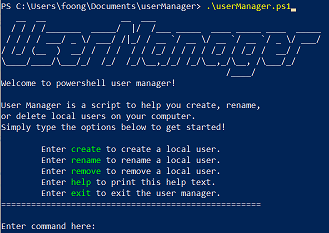
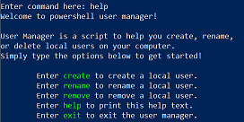
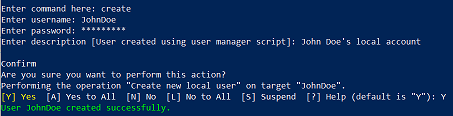
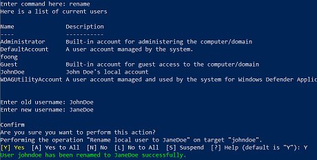
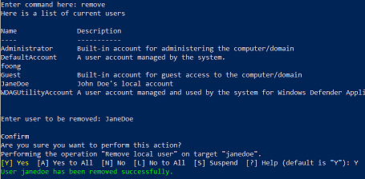

<pre>
   __  __               __  ___                                 
  / / / /_______  _____/  |/  /___ _____  ____ _____ ____  _____
 / / / / ___/ _ \/ ___/ /|_/ / __ `/ __ \/ __ `/ __ `/ _ \/ ___/
/ /_/ (__  )  __/ /  / /  / / /_/ / / / / /_/ / /_/ /  __/ /    
\____/____/\___/_/  /_/  /_/\__,_/_/ /_/\__,_/\__, /\___/_/     
                                             /____/             
</pre>

# Powershell User Manager

Powershell User Manager is a powershell application designed to help you create, rename, or remove local users interactively.

## Quickstart

These instructions will get you a copy of this application up and running on your local machine.

### Prerequisites

  * Admin privileges on your windows machine.

  1. Download or clone this repository.
  2. Go to the project root and execute `.\userManager.ps1`.

### To show help

  1. Enter command `help`.

### To create a new local user

  1. Enter command `create`.
  2. Provide new user username, password and description.

### To rename a local user

  1. Enter command `rename`.
  2. Provide old and new username of user to be renamed.

### To remove a local user

  1. Enter command `remove`.
  2. Provide user's username.

### To exit the application

  1. Enter command `exit`.

## Author

* **Foong Xin Yu** - [Uxinnn](https://github.com/Uxinnn)
